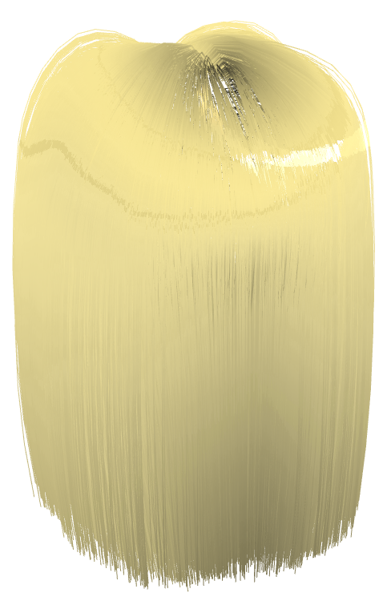
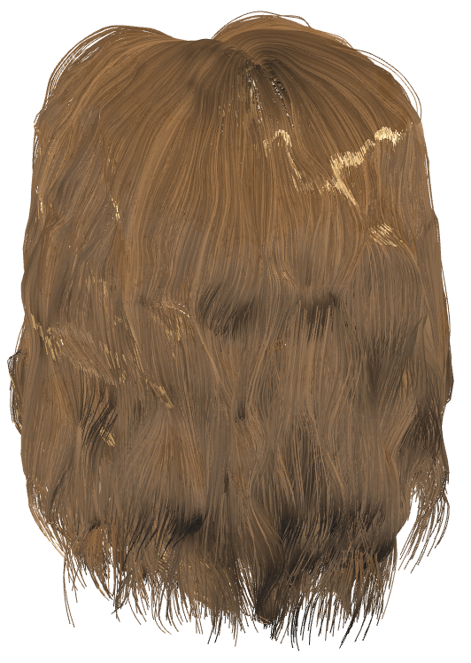

# Let Hair be Light

## 1. Introduction

## 2. How to Build & Run
Once you have cloned the repository, 

## 3. Overall architecture & results

   
  
Figure 1:  Blond and brown hair shaded with Marschner spectral lighting

Our final program is run through *HairSimulation.cpp*. We use *TurntableManipulator.cpp* so that the hair can be rotated and the change in spectral lighting can be observed.

The *cyHairFile.h* file creates the hair file ojbect to be drawn based on the *.hair* file given to it. The hair file is loaded in line 115.
```
LoadHairModel("dark.hair", hair, dirs);
```
We have two options for loading the hair. Either using the *dark.hair* file or the *straight.hair* file creating the brown and blond hair respectively.

In order to shade the hair we implemented our own vertex and fragment shaders. The same vertex shader is used for each method and we created 3 different options for fragment shading in line 66.
```
_shader.compileShader("marschnerHair.frag", GLSLShader::FRAGMENT);
```
*marschnerHair.frag* shader outputs our marschner shading implementation, and *variationHair.frag* and *basicHair.frag* output the hair variations technique and Cook-Torrance metal shading technique respectively.
  

## 4. Important performance issues & known bugs
Our spectral lighting doesn't show up on the hair exactly the same with each shader. More then being just a difference in equations the light doesn't seem to be positioned in the right place when we use the hair variations version of the frag. When using the variations.frag some computer's program will lag because of the computational cost of the equations.

## 5. Works Cited
[Cem Yuksel hair files](http://www.cemyuksel.com/research/hairmodels/)

[Cem Yuksel's hair header file](https://github.com/cemyuksel/cyCodeBase/blob/master/cyHairFile.h)

[voicualexandruteodor's blog post on Marschner shading](https://hairrendering.wordpress.com/2010/06/23/marschner-in-nalu-demo/)

[Hair variation shader github repo](https://github.com/mravella/hair)

